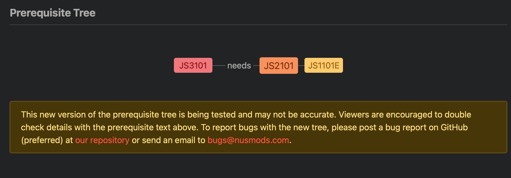
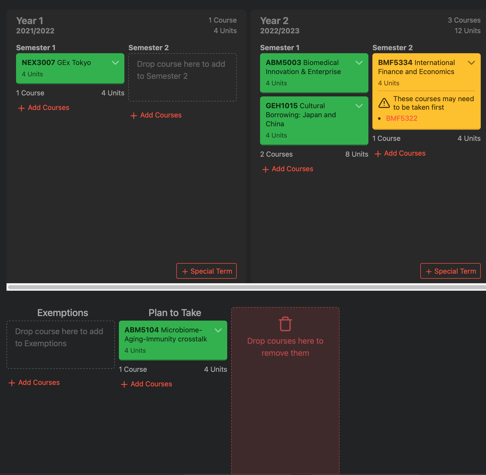

# Specification

## Features

### First Priority (v1.0.0?)

1. **Search:** Syllabus search feature
   1. Scraped from [Course Offerings](https://campus.icu.ac.jp/icumap/ehb/SearchCO.aspx)
   2. Advance filter
      1. Major
      2. Term (Multiple?)
      3. Keyword
      4. 100/200/300?
   3. Sorting
   4. Link to ICU Faculty Info
2. (**Save, Sync & View the Registration:** Enrolled courses save & view feature via online database)
   - should we actually prepare online database? perhaps we can just continue to use LocalStorage like [NUSMods](https://nusmods.com/)
   1. Calculate the sum of units
   2. Can compare multiple courses

### Second Priority

1. ~~**Course Recommendation**: Course recommendation system based on the user data with privacy security~~
   - this feature might be unnecessary cuz the comment feature or TES feature might make course comparisons easy
2. **Integrated curriculum tree**: (pre-required course list, interactive curriculum tree)
   - Good example in [NUSMods](https://nusmods.com/)
     
3. **Bucket List**: Save the courses u wanna take next year
   - Good example in [NUSMods](https://nusmods.com/)
     
4. **Requirement Checker**: Check Graduation/Major Requirements based on already enrolled courses list
5. **I'm feeling lucky**: show random courses to get serendipity
   1. Search for random academic keywords (e.g. "Stereochemistry", "Chomsky")
6. **TES, up-to-date**: Show TES over the years
   1. Can select instructors
7. **Comment for Courses (?)**: User Review of the Syllabus
8. **Import Required Courses**: ELA, 教職, 学芸員 (selecting feature of the courses from the 選択必修)
9. **Export to Google Calendar**

- we can (perhaps easily) implement this by setting Date strings to timetable data

11. [We will receive ideas for additional features via ましゅまろ or other social media, Google Form, GitHub from all the ICU students!! (after releasing v1.0.0)]

## Routing

### App

- https://www.catalogue.icu
- repo: https://github.com/ItsukiKigoshi/icu-catalogue

### API

- https://api.catalogue.icu (not yet deployed)
- repo: https://github.com/ItsukiKigoshi/icu-catalogue-api
- API Docs: https://api.catalogue.icu/docs (not yet deployed)

### Docs

- https://docs.catalogue.icu (this site)
- repo: https://github.com/ItsukiKigoshi/icu-catalogue-docs
